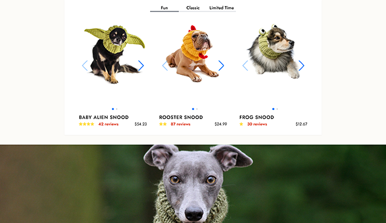
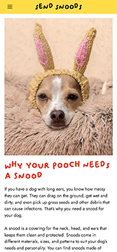
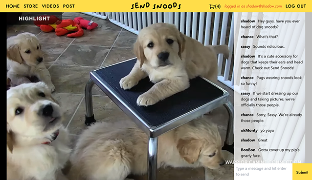
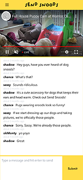
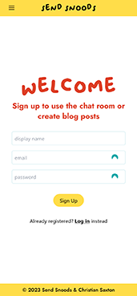

# Vue Portfolio 2023

## Technology

## Live Version
https://portfolio-36624.web.app/

## Features

### Home

- The landing page starts with a 2-up splash page to catch the eye
- Features a highlighted products carousel
- AI-generated blog posts are stored in the database and displayed in order of creation
- Each post has tags that, when clicked, shows a list of all posts with the same tags
- Registered and logged in users can create posts
- Users can only delete posts that they created

### Store

- The store displays a full line of products retrieved from the database, with prices and descriptions
- Product cards alternate images on mouseover or images can be swiped on mobile
- Products can be added to or removed from a cart that is persistent across page reloads

### Video Chat Room

- Users can chat with each other while watching a live stream from YouTube
- Chat messages are stored in the database and displayed with the newest messages at the bottom of the window
- Individual messages show the name of the user that sent it and how long it has been since it was sent

### Log in / Sign up

- Users are able to create and log in with accounts with username, email, and password
- The blog post creation and video chat room pages are only accessible by logged in users

### Nav Bar

- When logged in, the user's email address is displayed at the top of the screen
- The menu bar collapses into a hamburger menu on mobile

## Note

This is a fake website for my portfolio, so I grabbed the product images and descriptions mostly from Zoo Snoods (https://www.zoosnoods.com/). Go buy their products!