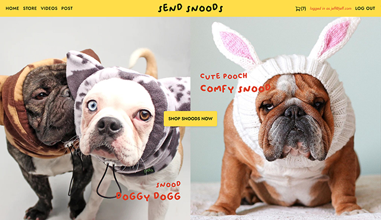
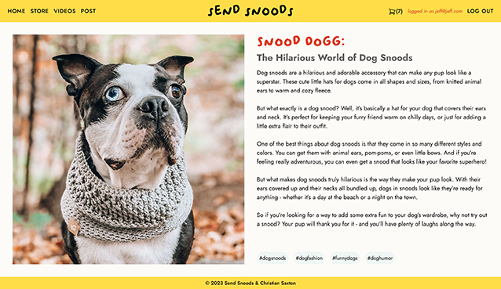

# Vue Portfolio 2023

## Technology

## Features

### Blog

- Blog posts are stored in the database and displayed in order of creation.
- Each post has tags that, when clicked, shows a list of all posts with the same tags.
- Registered and logged in users can create posts.
- Users can only delete posts that they created.

### Store

- The store displays a full line of products retrieved from the database, with AI-generated titles and descriptions.
- Product cards animate on mouseover.
- Products can be added to or removed from a cart that is persistent across page reloads.

### Chat Room

- Chat messages are stored in the database and displayed with the newest messages at the bottom of the window.
- Individual messages show the name of the user that sent it and how long it has been since it was sent.

### Nav Bar

- When logged in, the user's email address is displayed at the top of the screen.
- The menu bar collapses into a hamburger menu on mobile.

### Log in / Sign up

- Users are able to create and log in with accounts with username, email, and password.
- The blog post creation and chat room pages are only accessible by logged in users.

